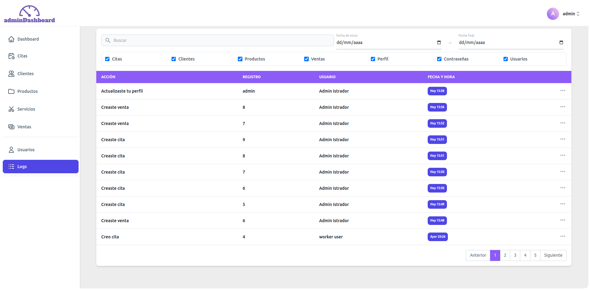
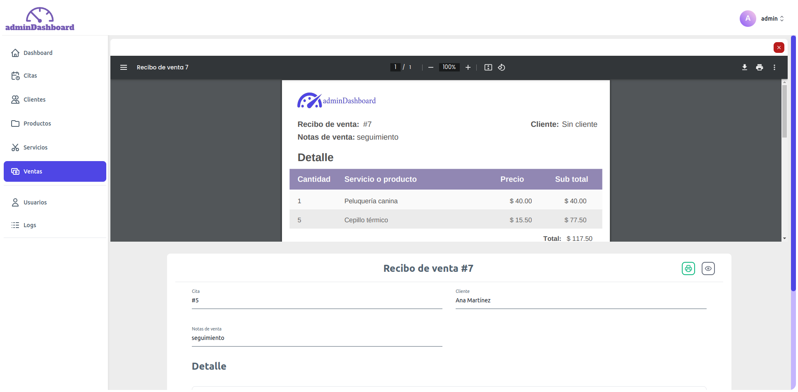

# AdminDashboard


## Descripción

AdminDashboard es un panel de administración adaptable a cualquier dispositivo, utilizado para el registro de citas, venta de servicios y productos, junto con su registro de ventas y generación de recibos en PDF. También incluye el registro de usuarios y manejo de roles.

<div style="clear:both"></div>

## Tecnologías Usadas

- **PHP**
- **JavaScript**

## Frameworks

- **Laravel** 
- **Tailwind CSS** 

## Instalación

Sigue estos pasos para configurar y ejecutar el proyecto:

1. **Clonar el repositorio:**

    ```bash
    git clone https://github.com/eduardoNBD/adminDashboard.git
    cd adminDashboard
    ```

2. **Instalar dependencias de PHP:**

    Asegúrate de tener [Composer](https://getcomposer.org/) instalado y ejecuta:

    ```bash
    composer install
    ```

3. **Configurar el archivo `.env`:**

    Copia el archivo `.env.example` a `.env` y configura tu entorno:

    ```bash
    cp .env.example .env
    ```

    Luego, genera la clave de la aplicación:

    ```bash
    php artisan key:generate
    ```

4. **Configurar la base de datos:**

    En el archivo `.env`, configura tus credenciales de base de datos:

    ```dotenv
    DB_CONNECTION=mysql
    DB_HOST=127.0.0.1
    DB_PORT=3306
    DB_DATABASE=nombre_de_tu_base_de_datos
    DB_USERNAME=tu_usuario
    DB_PASSWORD=tu_contraseña
    ```

5. **Configurar smtp:**

    En el archivo `.env`, configura tus credenciales de tu servidor smtp para poder recuperar contraseñas:

    ```dotenv
    MAIL_MAILER=smtp
    MAIL_HOST=mailpit
    MAIL_PORT=1025
    MAIL_USERNAME=null
    MAIL_PASSWORD=null
    MAIL_ENCRYPTION=null
    MAIL_FROM_ADDRESS="hello@example.com"
    MAIL_FROM_NAME="${APP_NAME}"
    ```
6. **Ajustar los permisos del sistema de archivos:**

    Asegúrate de que el servidor web tenga los permisos adecuados para escribir en las carpetas `storage` y `bootstrap/cache`:

    ```bash
    sudo chown -R www-data:www-data storage
    sudo chmod -R 775 storage
    sudo chown -R www-data:www-data bootstrap/cache
    sudo chmod -R 775 bootstrap/cache
    ```

7. **Migrar la base de datos:**

    Ejecuta las migraciones para crear las tablas necesarias y el usuario por default (usuario: admin, password: administrator):

    ```bash
    composer run migrate-user
    ```

8. **Instalar dependencias de JavaScript:**

    Asegúrate de tener [Node.js](https://nodejs.org/) y [npm](https://www.npmjs.com/) instalados y ejecuta:

    ```bash
    npm install
    ```

9. **Compilar Tailwind CSS:**

    Para generar el archivo de salida de Tailwind CSS, ejecuta:

    ```bash
    npm run compileTailwind
    ```

 
 

